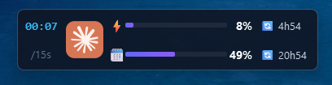
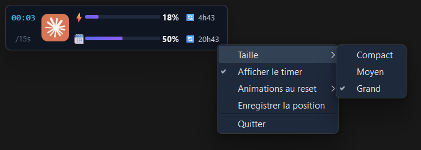

# Claude Session Stats


Overlay desktop ultra-compact qui affiche en temps réel l'utilisation de l'abonnement Claude.

---

## Demo

Vue :



Option :



Animation quand le quota est reset :


> *Le widget reste toujours visible au premier plan, draggable, sans barre de titre.*


---

## Comment ça marche

```
claude.ai (navigateur)
    └── Tampermonkey userscript
            └── POST http://localhost:7842/usage  (toutes les N secondes)
                    └── Serveur HTTP local (Python)
                            └── Overlay PySide6 (mise à jour en temps réel)
```

Le userscript interroge l'API de quota de `claude.ai` toutes les `INTERVAL_SEC` secondes, en profitant de votre session navigateur déjà authentifiée, puis envoie les données au serveur local Python qui met à jour le widget. **Aucun cookie, aucune clé API à configurer.**

---

## Utilisation

| Action | Résultat |
|--------|----------|
| **Clic gauche + drag** | Déplacer le widget |
| **Clic droit** | Ouvrir le menu d'options |
| Clic droit → **Taille** | Changer entre Compact / Moyen / Grand |
| Clic droit → **Afficher le timer** | Afficher/masquer le compteur de temps |
| Clic droit → **Animations au reset** | Activer/désactiver les alertes visuelles |
| Clic droit → **Enregistrer la position** | Sauvegarder la position actuelle dans `config.ini` |
| Clic droit → **Quitter** | Fermer l'application |

Les préférences sont sauvegardées automatiquement dans `config.ini`.

---

> Vous voulez installer depuis les sources ou compiler votre propre EXE ? → [BUILD_YOURSELF.md](BUILD_YOURSELF.md)